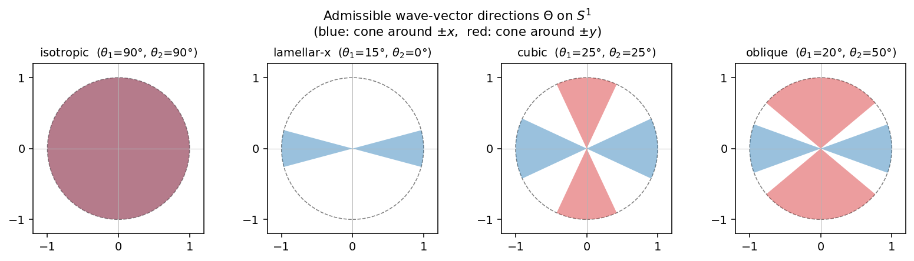
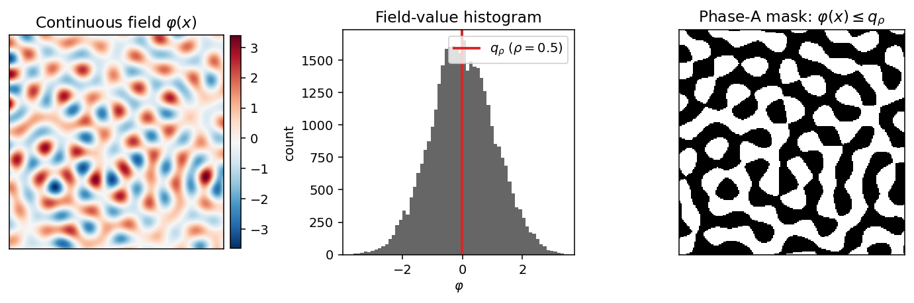
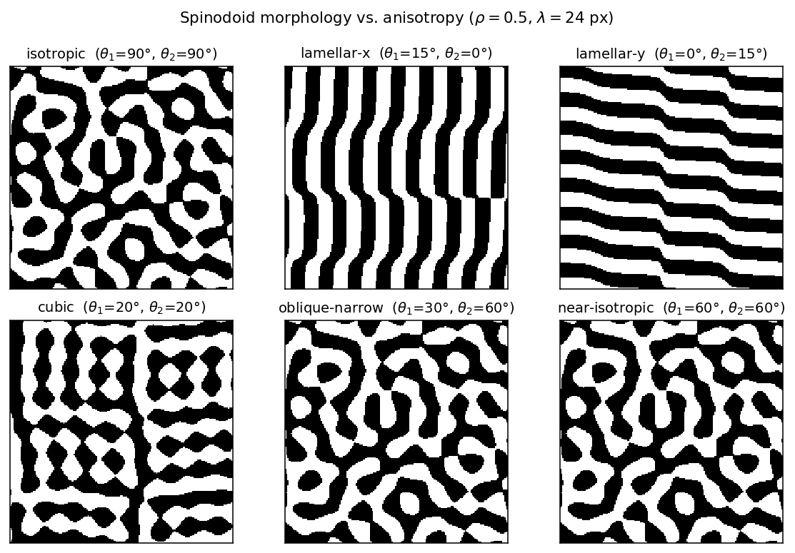
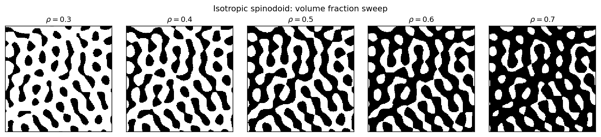
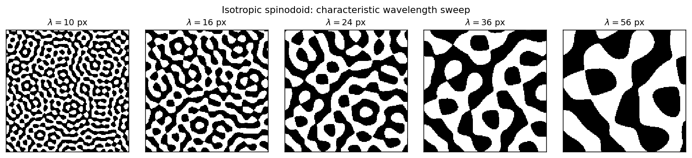

# 2D Spinodoid Bi-material Geometries

This document specifies the 2D spinodoid generator that will be added to
`fem_sim.geometry` as `make_spinodoid`. The morphology family is adapted from

> S. Kumar, S. Tan, L. Zheng, D.M. Kochmann.
> *Inverse-designed spinodoid metamaterials.*
> **npj Computational Materials** 6:73 (2020).
> [doi:10.1038/s41524-020-0341-6](https://doi.org/10.1038/s41524-020-0341-6)

The original work targets 3D spinodoid solid–void microstructures inspired by
the morphologies that arise during spinodal decomposition. Here we restrict to
the 2D case and use the resulting mask to assign **two solid phases (A / B)**,
matching the existing `make_grf_bimat` API. (Solid–void interpretation can be
recovered downstream when the FEM model is built — it is not the geometry's
job.)

---

## 1. Mathematical model

Spinodoid geometries are level sets of a Gaussian random field built as a
finite sum of plane waves with prescribed wavenumber and direction set.

### 1.1 Continuous field

Let $\Omega \subset \mathbb{R}^2$ be the pixel domain. The field is

$$
\varphi(\mathbf{x}) \;=\; \sqrt{\frac{2}{N}} \, \sum_{i=1}^{N} \cos\!\bigl(\beta\,\mathbf{n}_i\!\cdot\!\mathbf{x} + \gamma_i\bigr),
\qquad \mathbf{x}\in\Omega,
\tag{1}
$$

with

- $N$ — number of plane waves (kwarg, default 1000),
- $\beta = 2\pi / \lambda$ — wavenumber, $\lambda$ the **characteristic
  wavelength in pixels**,
- $\gamma_i \stackrel{\text{iid}}{\sim} \mathcal{U}[0, 2\pi)$ — random phases,
- $\mathbf{n}_i = (\cos\alpha_i,\sin\alpha_i)$ — unit wave-vector directions
  drawn iid from the **admissible set** $\Theta\subset S^1$ defined below.

By the central-limit theorem, $\varphi$ is asymptotically Gaussian with zero
mean and unit variance (the $\sqrt{2/N}$ prefactor enforces this for finite
$N$ in expectation).

### 1.2 Anisotropy / admissible direction set

Two cone half-angles $\theta_1, \theta_2 \in [0°, 90°]$ define $\Theta$ as the
union of two pairs of arcs on $S^1$:

$$
\Theta \;=\; \bigl\{ \alpha \;:\; |\cos\alpha| \ge \cos\theta_1 \;\;\text{or}\;\; |\sin\alpha| \ge \cos\theta_2 \bigr\}.
\tag{2}
$$

Equivalently, $\alpha$ is admissible if it lies within $\theta_1$ of the
$\pm x$-axis or within $\theta_2$ of the $\pm y$-axis. Notable cases:

| Regime | $(\theta_1, \theta_2)$ | Morphology |
|---|---|---|
| Isotropic | $(90°, 90°)$ | Bicontinuous blobs, no preferred direction |
| Lamellar (vertical stripes) | $(\theta, 0°)$, $\theta$ small | Waves along $\pm x$ → field constant in $y$ |
| Lamellar (horizontal stripes) | $(0°, \theta)$ | Waves along $\pm y$ → field constant in $x$ |
| Cubic / cross | both small | Mutually orthogonal wave families → cross-hatch |
| Oblique | mismatched, both nonzero | Two unequal lamellar families superposed |

When $\theta_1 = \theta_2 = 0$ the set is empty and the model is
ill-posed — the implementation will raise.



### 1.3 Phase assignment

The continuous field is converted to a binary phase mask by thresholding at
the empirical $\rho$-quantile, where $\rho = $ `volume_fraction` is the
target area fraction of phase A:

$$
q_\rho \;=\; \mathrm{quantile}_\rho\!\bigl(\varphi\bigr),
\qquad
\mathcal{M}_A \;=\; \bigl\{ \mathbf{x} \;:\; \varphi(\mathbf{x}) \le q_\rho \bigr\}.
\tag{3}
$$

The empirical quantile (rather than the asymptotic $\Phi^{-1}(\rho)$) is used
so the resulting mask hits the target volume fraction exactly modulo
tie-breaking, just like `make_grf_bimat`.

Material properties are then filled per pixel:

- $\mathcal{M}_A$: $(E_A, \nu_A, \rho_A)$, `mat_id = 1`.
- $\Omega \setminus \mathcal{M}_A$: $(E_B, \nu_B, \rho_B)$, `mat_id = 2`.
- `solid_mask = 1` everywhere (fully solid bi-material — no void in geometry).



---

## 2. Algorithm

```
inputs : H, W, theta1_deg, theta2_deg, wavelength, volume_fraction,
         n_waves, seed, (E_A, nu_A, rho_A), (E_B, nu_B, rho_B)

1. beta  <- 2 * pi / wavelength
2. alphas <- rejection-sample n_waves angles from Theta (eq. 2)
3. gammas <- uniform[0, 2*pi), size n_waves
4. xx, yy <- pixel-coordinate grids (origin bottom-left, integer spacing)
5. phi <- sqrt(2/N) * sum_i cos(beta * (cos(alpha_i)*xx + sin(alpha_i)*yy) + gamma_i)
6. q   <- empirical volume_fraction-quantile of phi
7. mask_A <- (phi <= q)
8. fill geometry array (5, H, W) per fill_material conventions
9. return geo
```

Step 2 is rejection sampling on $[0, 2\pi)$; the acceptance rate is
the angular measure of $\Theta$ divided by $2\pi$, so it is $\ge 1/2$
whenever $\theta_1 + \theta_2 \ge 45°$ and never below
$2(\theta_1+\theta_2)/\pi$.

Step 5 is vectorised: for $N=1000$ waves on a $192\times 192$ grid the
peak working memory is $\sim 300$ MB and the elapsed time is $\sim 0.3$ s
on a laptop. For larger grids the sum can be batched over $N$ to keep
memory bounded.

---

## 3. Morphology gallery

All panels: $\rho = 0.5$, $\lambda = 24$ px, $192 \times 192$ pixels,
$N = 2000$ waves.



### 3.1 Volume-fraction sweep (isotropic)



### 3.2 Wavelength sweep (isotropic)



The wavelength $\lambda$ controls the characteristic feature size: blob
diameters are roughly $\lambda/2$. Choose $\lambda$ so several features
fit in the domain (typically $\lambda \in [W/16, W/4]$).

---

## 4. Planned API

```python
def make_spinodoid(
    h: int,
    w: int,
    *,
    theta1_deg: float = 90.0,
    theta2_deg: float = 90.0,
    wavelength: float = 16.0,
    volume_fraction: float = 0.5,
    n_waves: int = 1000,
    seed: int = 42,
    E_A: float = 30.0,    nu_A: float = 0.48, rho_A: float = 1.2e-9,    # TPU
    E_B: float = 3500.0,  nu_B: float = 0.36, rho_B: float = 1.24e-9,   # PLA
) -> np.ndarray:
    """Two-phase spinodoid pattern (Kumar et al. 2020, 2D)."""
```

- Returns the standard `(5, H, W)` geometry array.
- Defaults match `make_grf_bimat` (TPU/PLA in MPa–mm–ms units) so it slots
  into the existing materials-library/slot machinery (`_A`, `_B` suffixes)
  in `campaign.py` without changes — `materials: [TPU, PLA]` works as-is.
- Will be registered as `"spinodoid"` in `_GEO_GENERATORS` and re-exported
  from the package root.
- Will raise `ValueError` if `theta1_deg == 0 and theta2_deg == 0` (empty
  $\Theta$), if `wavelength <= 0`, or if `not 0 < volume_fraction < 1`.

### 4.1 Tests (`tests/test_geometry.py :: TestSpinodoid`)

1. Output shape `(5, H, W)`, dtype `float64`, and `solid_mask` all-ones.
2. Determinism: same `seed` ⇒ identical output.
3. Volume fraction within $\pm 0.02$ of target at $N=2000$.
4. Empty-set guard raises on $(\theta_1, \theta_2) = (0, 0)$.
5. Lamellar limit ($\theta_1 = 5°$, $\theta_2 = 0°$): row-wise variance of
   the mask is $\gtrsim 10\times$ column-wise variance (vertical stripes).
6. Isotropic limit: row- and column-wise variances within $\pm 30\%$ of
   each other on a $128\times 128$ grid (sanity: no preferred direction).

---

## 5. References

1. Kumar, S., Tan, S., Zheng, L., Kochmann, D.M. *Inverse-designed
   spinodoid metamaterials.* npj Computational Materials **6**, 73 (2020).
   <https://doi.org/10.1038/s41524-020-0341-6>
2. Cahn, J.W. *Phase separation by spinodal decomposition in isotropic
   systems.* J. Chem. Phys. **42**, 93–99 (1965). — original physical
   model that the GRF-of-plane-waves construction approximates.
